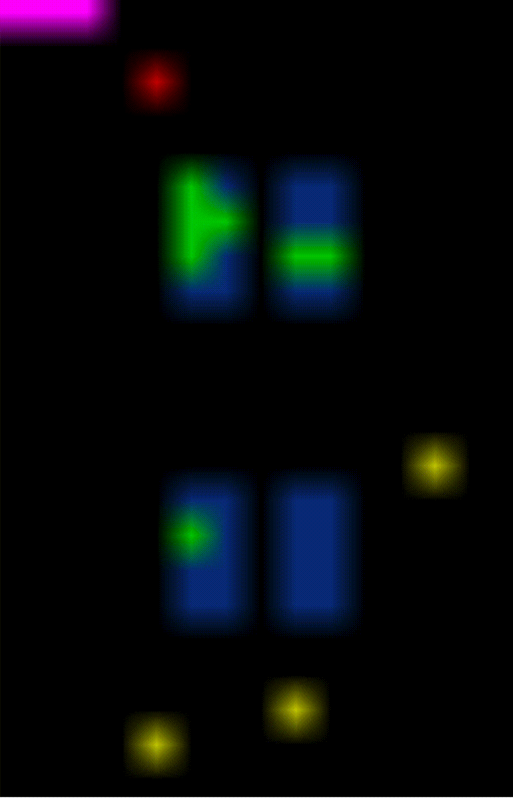

A simulator for a robotic warehouse written as a openAI gym https://gym.openai.com/


- [Installation](#installation)
- [Usage](#Usage)
- [Action Space](#action-space)
- [Observation Space](#observation-space)
- [Performance](#performance)
- [Examples](#examples)

Installation
---
```bash
> git clone https://github.com/kex2019/robotic_warehouse.git
> cd robotic_warehouse
> python3 setup.py install
```

Installing this way won't permit rendering.
- https://pypi.org/project/opencv-python/ is required to use rendering
since it is quite a big dependency it is not included in the default installation

Usage
---
```python
import robotic_warehouse.robotic_warehouse as rw

gym = rw.RoboticWarehouse(
    robots=4, # Number of robots on the map
    capacity=1, # Number of packages each robot can carry
    spawn=10, # Number of packages spawned in begining
    spawn_rate=0.001, # Number of packages spawned each step
    shelve_length=4, # The length of a shelve
    shelve_height=2, # The number of shelves on y axis (Will fix variable name.. :))
    shelve_width=2, # The number of shelves on x axis (Will fix variable name.. :))
    shelve_throughput=1, # Number of robots that can pass between shelves
    cross_throughput=5) # Number of robots that can pass in other places


while True:
    gym.render()
    gym.step(gym.action_space.sample())
```

Action Space
--- 
- List of Actions [Action] (One action per robot)
  - Action is one of -> 0 | 1 | 2 | 3 | 4 | 5
    - 0: Move Down
    - 1: Move Left
    - 2: Move Up
    - 3: Move Right
    - 4: Pickup Package
    - 5: Drop Package


Observation Space
---
This is yet to be decided but at the moment it is
- A tuple (robots, packages)
  - Robots is a list of robot [Robot]
    - Robot is a list of two items [Position, Packages]
      - Position tuple: [Y, X]
      - Packages [Package]
        - Package tuple: [From, To] (Where it is supposed to be taken from and to)
          - From: [Y, X]
          - To: [Y, X]
  - Packages is a list of Package [Package]
    -  (Same as each robot has)


Performance
---

Metric is based on
- 100 Robots
- shelve width = 10
- shelve height = 10
- shelve length = 10

It is the 'big' map rendered in the example below


Running on a MacBook Pro 2014 with Intel i7 CPU
- With rendering ~ 100 steps per second
- Without rendering ~ 200000 steps per second

Examples
---

These are running the example code provided above. This means that the robots are just issuing random commands and that is the explanation of their erratic behavior! :) 
- The robots are initially red
- The shelves are Blue
- The packages are green
- The drop-off spots are purple
- When a robot picks up a package it becomes yellow
<div align="center">
  
  
</div>

For Methods that would use visual input: one can augment these in the render method https://github.com/kex2019/robotic_warehouse/blob/master/robotic_warehouse/robotic_warehouse.py#L382
